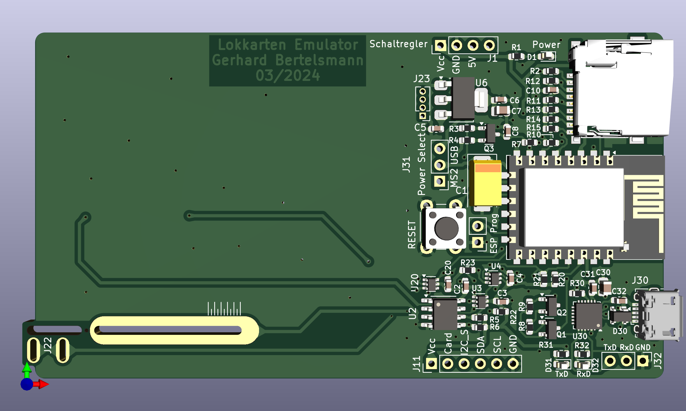

Lokkarten Emulator
==================





Auf der Lokkarte befindet sich ein I2C EEPROM (24LC64 64kBit -> 8kByte). Die Schaltung
ersetzt den Speicher durch ein kompatiblen FRAM Baustein (U2). Dadurch entfällt die
zeitkritische I2C Slave Behandlung.

Der Prozessor (ESP8266 oder extern) befüllt den FRAM Baustein mit Lokkarten Daten. Damit
es zu keinen Komplikationen auf dem MS2 I2C Bus kommen kann, ist der I2C Bus durch analoge
Schalter (BL1551B - Signal I2C_Select) getrennt.

Der Prozessor signalisiert das Einstecken der Lokkarte (Signal Card) durch Verbindung
der Kontakte am Kartenrand.

Die Platine wurde mit KiCad 7.0.11 erstellt. Die Produktionsdaten wurden mit dem JLCPCB
Fabrication Toolkit Plugin generiert (Verzeichnis production). Platinendicke: 0,8 mm wählen !

Die zwei Fehler im DRC Check (Corteyards overlap) können ignoriert werden, da die Bestückung
mit dem SPI EEPROM U10 und C11 alternativ ist.


Detail-Beschreibung
-------------------

Der Kartenwechsel wird bei der MS2 über einen mechanischen Taster erkannt. Bei der MS2 wurden
verschiedene Arten des Tasters verbaut. Die Platine verwendet einen federnden Testpin, damit
ein Kartenwechsel für die verschiedene Bauarten simuliert werden kann:
https://dirtypcbs.com/store/designer/details/ian/12/dirty-pogo-pins

Power Select: hier wählt man zwiechen Versorgung durch MS2 oder USB.

Schaltregler kann als Ersatz dienen, wenn der Längsregler U6 nicht ausreicht.
Dazu muss U6 aber entfernt werden.

Für C1 ist ein Tantal Kondensator vorgesehen. Da Tantal aber ein Rohstoff aus Krisengebieten
ist, ist ein anderer Kondensator mit niedrigem ESR ratsam. Die Pads sollten genügend Platz bieten,
einen anderen Kondensator einzusetzen, wie z.B. Reichelts "VF 100/6,3 P-C" oder "VF 100/16 P-D".

Silabs CP2102 wurde für die Seriell-USB Anbindung gewählt, weil dieser ein guter Kompromiss
zwischen Stabilität, Unterstützung und Preis ist.

Q1/Q2 und R8/R9 dienen dazu, das Update der ESP8266 ohne Eingriff zu ermöglichen.

U3 und U4 trennen den I2C Bus von der MS2, damit es keine Störungen des MS2 I2C-Busses gibt.
I2C Select schaltet entweder den ESP8266 oder alternativ einen anderen I2C Master
für den Zugriff auf das FRAM hinzu.

U20 dient dazu, einen Kartenwechsel der MS2 zu signalisieren.

Das MS2 I2C Bus Clock Signal wird zusätzlich auch noch über Q1 und ein RC Glied an den ADC
des ESP8266 Moduls angeschlossen, um den Zeitpunkt des letzten I2C Bus Zugriffs zu messen.

TODOs/Done
----------

- CP2102 Test  - OK
- I2C intern Test - OK
- I2C extern Test - OK
- ESP Programmierung Test - OK
- SD Kartenanbindung Test - OK
- Allternative zur SD-Karte - SPI EEPROM - ungetestet

Hardware / neue Version
- 470 nH Vdd

ESP8266 - Code Segmente
-----------------------

```
#define SPI_MISO    12
#define SPI_MOSI    13
#define SPI_CLK     14
#define SPI_CS      15

#define I2C_Select   2
#define I2C_SDA      4
#define I2C_SCL      5
#define Card_Change 16

void setup () {
  // SD Karte initialisieren
  SD.begin(SPI_CS)

  // I2C initilisieren
  Wire.begin(I2C_SDA, I2C_SCL);
  Wire.setClock(100000);

  pinMode(Card_Change, OUTPUT);
  pinMode(I2C_Select, OUTPUT);
}

  // MS2 I2C FRAM Zugriff
  digitalWrite(I2C_Select, 0);
  ...
  // MS2 ESP8266 FRAM Zugriff
  digitalWrite(I2C_Select, 1);

  // Kartenwechsel emulieren
  digitalWrite(Card_Change, 0)
  delay(500);
  digitalWrite(Card_Change, 1)

```


Flashing
--------
```
esptool.py --port /dev/ttyUSB1 erase_flash
esptool.py --port /dev/ttyUSB1 --baud 460800 write_flash --flash_size=detect 0 ./build_output/firmware/tasmota.bin
```

SD-CARD
-------
https://github.com/arendst/Tasmota/discussions/13938

https://www.mikrocontroller.net/articles/MMC-_und_SD-Karten


OLD - BACKUP
------------

Raspberry Pi I2C
----------------

|Function  | GPIO   | Pin    |      |
|----------|--------|--------|------|
|SDA       | GPIO2  | Pin 3  |      |
|SCL       | GPIO3  | Pin 5  |      |


Tasmota Tests
-------------

git clone https://github.com/arendst/Tasmota.git
cd Tasmota
git tag
pio run

{"NAME":"ESP-12F","GPIO":[1,1,1,1,1,1,0,0,1,1,1,1,1,1],"FLAG":0,"BASE":18}


user_config_override.h
```
// Select none or only one of the below defines USE_RULES or USE_SCRIPT
#ifdef USE_RULES 
#undef USE_RULES                                // Add support for rules (+8k code)
#endif

#ifndef USE_SCRIPT
#define USE_SCRIPT
#endif
#define SDCARD_DIR //Not essential I think
#define USE_SCRIPT_FATFS_EXT //Not essential I think
#define USE_SCRIPT_FATFS //Not essential I think
#define USE_UFILESYS
#define USE_SDCARD
#define SDCARD_CS_PIN 4 //Not strictly necessary since the same #define happens in xdrv_50_filesystem.ino

//Further down I define SPI

#define USE_SPI
```


